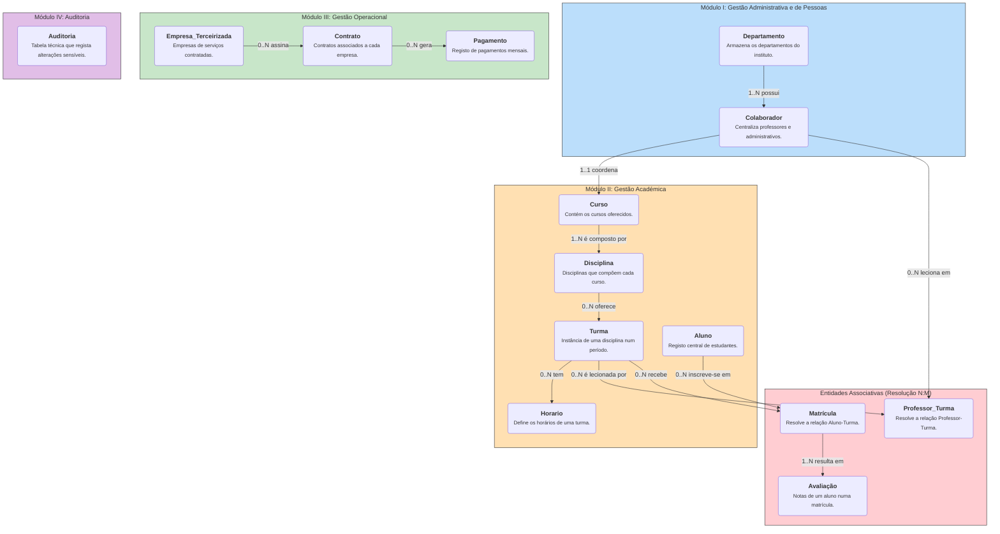

**SIGEPOLI - Projeto Final de Base de Dados II**

Este repositório contém o projeto final para a cadeira curricular de **Base de Dados II**, da Licenciatura em Engenharia Informática do Instituto Superior Politécnico de Tecnologias e Ciências (ISPTEC).

---

## Índice

1. [Sobre o Projeto](#sobre-o-projeto)
2. [Modelo Conceitual da Base de Dados](#modelo-conceitual-da-base-de-dados)
3. [Tecnologias Utilizadas](#tecnologias-utilizadas)
4. [Como Executar o Projeto](#como-executar-o-projeto)
5. [Funcionalidades Implementadas](#funcionalidades-implementadas)
6. [Autor](#autor)

---

## Sobre o Projeto

O **SIGEPOLI** (Sistema Integrado de Gestão Académica, Pessoal e Operacional) é um projeto de base de dados relacional desenhado para gerir de forma integrada as principais operações de uma instituição de ensino superior.

O sistema foi modelado para cobrir três áreas de negócio críticas:

* **Gestão Académica**: Controle de cursos, disciplinas, turmas, matrículas de alunos e lançamento de avaliações.
* **Gestão de Pessoas**: Administração de colaboradores, incluindo docentes, pessoal administrativo, chefes de departamento e coordenadores de curso.
* **Gestão Operacional**: Gestão de contratos e pagamentos a empresas terceirizadas (ex.: limpeza, segurança), com controle de Acordos de Nível de Serviço (SLA).

O objetivo principal é centralizar a informação, eliminar redundâncias e fornecer mecanismos robustos para garantir a integridade e a rastreabilidade dos dados.

---

## Modelo Conceitual da Base de Dados

Abaixo segue o diagrama de alto nível do sistema, com as principais entidades e respetivas relações.



---

## Tecnologias Utilizadas

* **SGBD**: MySQL
* **Ferramenta de Modelação**: MySQL Workbench

---

## Como Executar o Projeto

Siga os passos abaixo para criar e popular a base de dados **SIGEPOLI** no seu ambiente local.

### Pré-requisitos

* MySQL Server instalado
* MySQL Workbench (ou outro cliente SQL compatível)

### Passos de Instalação

1. Clone este repositório:

   ```bash
   git clone https://github.com/seu-usuario/sigepoli.git
   ```
2. Abra o seu cliente SQL e conecte-se ao servidor MySQL.
3. Execute os scripts SQL pela ordem abaixo:

   ```bash
   # Criação do esquema e tabelas
   mysql -u usuario -p < scripts/1_ddl_schema.sql

   # Inserção de dados de teste
   mysql -u usuario -p < scripts/2_dml_inserts.sql

   # Lógica de negócio: procedures, functions e triggers
   mysql -u usuario -p < scripts/3_procedures.sql
   mysql -u usuario -p < scripts/4_functions.sql
   mysql -u usuario -p < scripts/5_triggers.sql
   ```
4. A base de dados estará pronta para consulta e testes.

---

## Funcionalidades Implementadas

### Stored Procedures

* **sp\_matricular\_aluno**: Realiza a matrícula de um aluno, validando vagas e estado das propinas (RN02).
* **sp\_alocar\_professor**: Aloca um docente a uma turma, prevenindo conflitos de horário (RN01).
* **sp\_processar\_pagamento**: Processa pagamentos a empresas, calculando multas com base no SLA (RN05).

### Functions

* **fn\_calcular\_media\_ponderada**: Calcula a média final ponderada de um aluno numa disciplina.
* **fn\_obter\_sla\_mensal**: Consulta o SLA apurado para um contrato no mês.

### Triggers

* **trg\_auditoria\_matriculas**: Regista log na tabela Auditoria após cada nova matrícula.
* **trg\_auditoria\_pagamentos**: Regista log na tabela Auditoria após cada novo pagamento.
* **trg\_bloquear\_pagamento\_sem\_garantia**: Bloqueia pagamento se a garantia do contrato estiver expirada (RN04).

### Views

* **vw\_grade\_horaria\_curso**: Relatório consolidado da grade horária por curso.
* **vw\_carga\_horaria\_professor**: Resumo da carga horária total por docente.
* **vw\_resumo\_custos\_servicos**: Agrega custos mensais com serviços terceirizados.

---

## Autor

**Willfredy Eliúde Pinto Vieira Dias**
[willfredvd@gmail.com](mailto:o.seu.email@exemplo.com)

> Projeto desenvolvido no âmbito da avaliação da cadeira de Base de Dados II.
